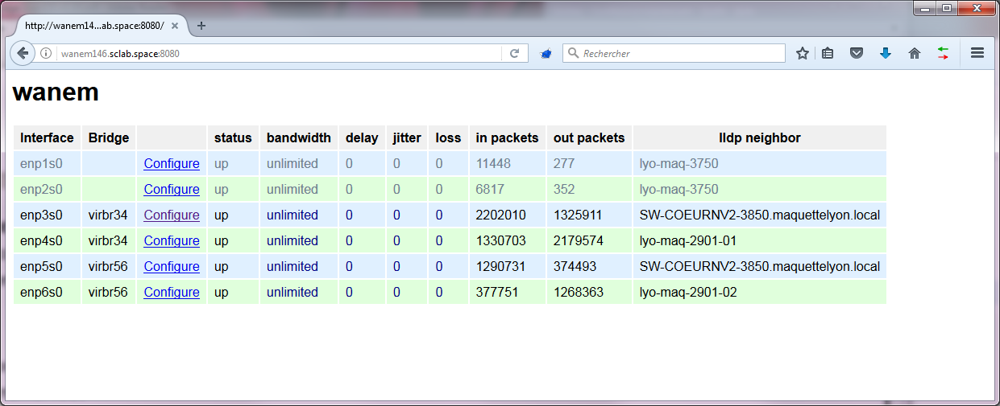

# wanem: A non disruptive wan emulator for virtual and physical appliances

wanem is a clean web interface which remotely configure the linux traffic control driver (tc). It is a great way to simulate a wan environment for testing purposes.


## features: 
* automated interfaces discovery
* display the bridge interface associated to native interfaces
* report facing device name such as reported by LLDP
* report interfaces statistics
* limit bandwidth per interface
* adjust delay, loss and jitter per interface
* built for bridges, does not change your VLAN attribution and IP setup




## Installation

First, create bridge interfaces on your appliance and connect each bridge interface to two physical interfaces. Configure a real or a dummy IP address on each bridge.
Connect each WAN end to a physical interface.
Install and start wanem and use the HTML interface to configure the bandwidth, the delay, the packet loss and the jitter of each interface.

### Installing on Debian

```
apt-get update
apt-get install ruby bridge-utils lldp ruby-dev
gem install sinatra
gem install thin
git clone https://github.com/PJO2/wanem
cd wanem
ruby ./http_main.rb
```


### Installing on Cumulus Linux
ruby-dev is not a package, should be installed manually

```
wget http://security.debian.org/debian-security/pool/updates/main/r/ruby2.1/ruby2.1-dev_2.1.5-2+deb8u6_amd64.deb
wget http://ftp.us.debian.org/debian/pool/main/g/gmp/libgmp-dev_6.0.0+dfsg-6_amd64.deb
wget http://ftp.us.debian.org/debian/pool/main/g/gmp/libgmpxx4ldbl_6.0.0+dfsg-6_amd64.deb

dpkg -i libgmpxx4ldbl_6.0.0+dfsg-6_amd64.deb
dpkg -i libgmp-dev_6.0.0+dfsg-6_amd64.deb
dpkg -i ruby2.1-dev_2.1.5-2+deb8u6_amd64.deb

gem install sinatra:1.4.8
gem install thin
git clone https://github.com/PJO2/wanem
cd wanem
ruby ./http_main.rb
```


### Installing on CentOs

Main concern is to stop NetworkManager, which does not support bridging.  Then install as follow.

```
# Stop networkmanager
service NetworkManager stop
systemctl disable NetworkManager.service

yum install epel-release
yum update

yum group info "Development Tools"
yum install bridge-utils lldpd ruby ruby-dev
gem install sinatra:1.4.8
gem install thin

git clone https://github.com/PJO2/wanem
cd wanem
ruby ./http_main.rb
```

## making wanem start on boot
Add a @reboot line into the crontab
(Note: PATH setup is only necessary for CentOS).

```
crontab -e
add a line : 
@reboot (export PATH='/bin:/sbin:/usr/bin:/usr/sbin' && cd home/ark/wanem && ruby http_main.rb &> /dev/null &)
```
